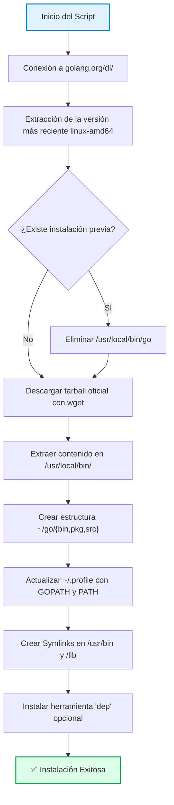

# 🐹 Script Install Golang

> **Script de automatización en Bash** para la instalación limpia y actualización a la última versión estable de **Go (Golang)** en sistemas basados en Debian/Ubuntu (como Lubuntu).

Este script resuelve el problema común de que los repositorios oficiales de las distribuciones Linux (`apt`) suelen contener versiones desactualizadas del lenguaje. Al conectarse directamente al portal oficial de Go, descarga e instala los binarios más recientes, garantizando un entorno de desarrollo moderno y optimizado.

---

## 🚀 Características Principales

- ⚡ **Instalación de la Última Versión**: Extrae automáticamente el nombre del archivo `.tar.gz` más reciente para arquitectura `linux-amd64` desde `golang.org/dl/`.
- 🧹 **Limpieza Inteligente**: Detecta y elimina instalaciones previas en `/usr/local/bin/go` para evitar conflictos de versiones o archivos residuales.
- 📂 **Estructura Estándar**: Configura el entorno siguiendo las mejores prácticas de la documentación oficial de Go:
  - Instalación de binarios en `/usr/local/bin/go`.
  - Creación de la estructura de trabajo en `~/go/{bin,pkg,src}`.
- 🔗 **Enlaces Simbólicos Globales**: Crea symlinks en `/usr/bin/go` y `/lib/go` para asegurar que el comando sea accesible desde cualquier terminal sin necesidad de reiniciar la sesión.
- ⚙️ **Configuración Persistente**: Añade automáticamente las variables `GOPATH` y `PATH` al archivo `~/.profile` del usuario.

---

## 🏗️ Flujo de Ejecución del Script



---

## 📋 Requisitos Previos

- Sistema operativo basado en **Debian/Ubuntu** (probado en Lubuntu 22.04.1 y derivados).
- Permisos de **sudo** para instalar archivos en directorios del sistema.
- Conexión a Internet activa.
- Herramientas básicas: `wget`, `grep`, `tar`.

---

## 🛠️ Instalación y Uso

### Opción 1: Ejecución Directa (Recomendada)
Copia y pega este comando en tu terminal para descargar y ejecutar el script automáticamente:

```bash
bash <(curl -s https://raw.githubusercontent.com/MartinCiro/ScriptInstallGolang/main/install.sh)
```

### Opción 2: Descarga Manual
1. Clona o descarga el archivo `install.sh`.
2. Dale permisos de ejecución:
   ```bash
   chmod +x install.sh
   ```
3. Ejecútalo como superusuario:
   ```bash
   sudo ./install.sh
   ```

---

## ⚙️ ¿Qué hace exactamente el script?

1. **Detección de Versión**: 
   ```bash
   GoV="$(wget -qO- https://golang.org/dl/ | grep -oP 'go([0-9\.]+)\.linux-amd64\.tar\.gz' | head -n 1)"
   ```
2. **Limpieza**: Si detecta una versión anterior, ejecuta `sudo rm -rf /usr/local/bin/go`.
3. **Instalación**: Extrae el archivo descargado directamente en la ruta estándar.
4. **Persistencia**: Añade las siguientes líneas a tu `~/.profile`:
   ```bash
   export GOPATH=~/go
   export PATH=$PATH:/usr/local/bin/go/bin/:$GOPATH/bin
   ```

---

## 🔄 Actualización

Para actualizar Go a la última versión disponible, simplemente **vuelve a ejecutar el mismo script**. El proceso de limpieza integrado se encargará de borrar la versión antigua antes de instalar la nueva, manteniendo tu entorno siempre al día.

```bash
bash <(curl -s https://raw.githubusercontent.com/MartinCiro/ScriptInstallGolang/main/install.sh)
```

---

## 👤 Autor

**Martin Ciro**  
[](https://github.com/MartinCiro)

---
*Desarrollado para facilitar el mantenimiento de entornos de desarrollo Go en distribuciones Linux.*